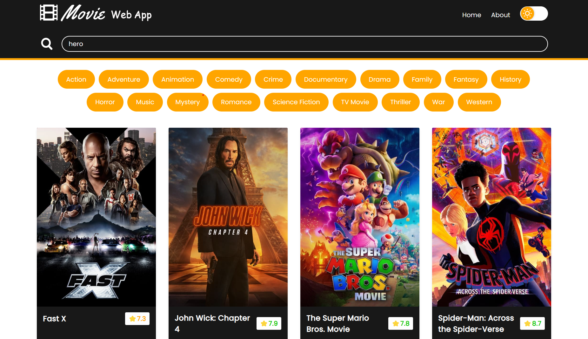

# Weather Web App



## Welcome! 👋

Thanks for checking out this repository.

**This project is built with HTML, CSS, and JavaScript.**

## Getting Started

This project was scaffolded with Vite. In the project directory, you can run:

```sh
npm install && npm run dev
```

To install all the project dependencies.

Open [http://localhost:5173](http://localhost:5173) to view it in your browser.

## The Project

- This project is a movie web application that enables users to browse information about their favorite movies. Users can get short descriptions, movie ratings, trailers and review videos.
- Users can search for movies and further filter out query results via movie genres.
- Pagination allows users to view multiple results for their search query.
- Users can switch to dark mode for better display at low lighting conditions or at night.

Users should be able to:

- Search for movies.
- Get genres specific movies.
- Browse through multiple results via pagination.
- Switch between dark and light modes.

## Deploying your project

There are many ways to host your project for free. Recommend hosts are:

- [GitHub Pages](https://pages.github.com/)
- [Vercel](https://vercel.com/)
- [Netlify](https://www.netlify.com/)

**Have fun playing around!** 🚀
